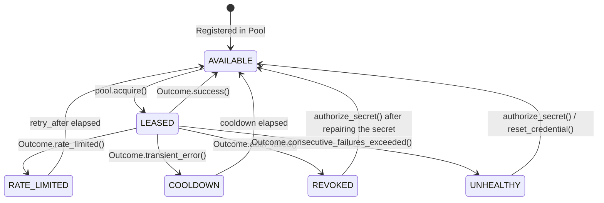

<div align="center">

# 🧵 CredWeave

**Provider-agnostic credential pooling, intelligent scheduling, rate-limit cooldown, and automatic failover for Python.**

[](https://pypi.org/project/credweave/)
[](https://www.python.org/downloads/)
[](https://opensource.org/licenses/MIT)
[](https://github.com/astral-sh/ruff)
[](https://mypy-lang.org/)
[-brightgreen.svg)](pyproject.toml)

<p align="center">
  <a href="#why-credweave">Why CredWeave?</a> •
  <a href="#key-features">Key Features</a> •
  <a href="#core-design-philosophy">Design Philosophy</a> •
  <a href="#quickstart">Quickstart</a> •
  <a href="#the-lease-lifecycle">Lease Lifecycle</a> •
  <a href="#scheduling-strategies">Strategies</a> •
  <a href="#credential-sources">Sources</a> •
  <a href="#security-guarantees">Security</a> •
  <a href="#clean-architecture">Architecture</a>
</p>

</div>

---

## 📌 Why CredWeave?

Production applications communicating with external services—such as LLM APIs, cloud providers, and third-party SaaS—often start with a single API key in an `.env` file.

As workload scale increases, systems quickly outgrow single-credential architectures:

- 🏢 **Multiple Accounts & Tenants:** Distributing load across organization tiers, departments, or multiple provider accounts.
- ⏱️ **Rate-Limit Throttling:** Handling `429 Too Many Requests` spikes requiring automated cooldown windows and upstream `Retry-After` adherence.
- 🔀 **Failover & High Availability:** Automatically routing around revoked tokens, depleted credit quotas, or regional outages without downtime.
- 🔄 **Dynamic Scheduling:** Balancing requests fairly using Round-Robin, Weighted distribution, or Least-Recently-Used heuristics.
- 🔒 **Security Risks:** Secret values accidentally leaking into APM traces, exception tracebacks, or console logs.

Most teams end up hand-crafting fragile, ad-hoc rotation loops tightly coupled to a specific HTTP client (`httpx`, `requests`) or provider SDK (`openai`, `anthropic`).

**CredWeave** solves this once and for all: a clean, reusable, protocol-agnostic credential lifecycle engine for Python with **zero external dependencies**.

---

## ✨ Key Features

| Feature | Description |
| :--- | :--- |
| 🛡️ **Secret-Safe by Design** | Secrets are automatically masked (`***`) in `repr()`, `str()`, and exception messages. Zero accidental leaks in logs. |
| 🔌 **Protocol & Client Agnostic** | Works seamlessly with **any** HTTP client, gRPC client, or provider SDK (`httpx`, `aiohttp`, `requests`, OpenAI, etc.). |
| ⏳ **Intelligent Cooldowns** | Automatically isolates rate-limited keys with fixed durations or exponential backoff, respecting upstream `retry_after`. |
| 🔀 **Resilient Failover** | Seamlessly pivots to secondary/backup credential tiers when primary quotas are exhausted or credentials fail. |
| 🔄 **Pluggable Scheduling** | Round-robin, weighted allocation, least-recently-used, least-used, failover, and randomized strategies. |
| 📊 **Outcome-Driven Lifecycle** | Simple lease model where clients report execution outcomes (`success`, `rate_limited`, `auth_failed`, `transient_error`). |
| 🪶 **Zero Dependencies** | Built strictly on the Python standard library. Hyper-lightweight and blisteringly fast. |
| 🏗️ **Clean Architecture** | Strict inward dependency rule: pure Domain models, well-defined Application ports, and pluggable Infrastructure. |

---

## 💡 Core Design Philosophy

> [!IMPORTANT]
> **CredWeave manages credentials and their lifecycle. It does not perform network requests itself.**

```text
┌─────────────────────────────────────────────────────────────────┐
│                      Your Application / Task                    │
│                                                                 │
│   1. Acquire Lease         2. Make Request     3. Report Result │
└───────────┬───────────────────────┬─────────────────────▲───────┘
            │                       │                     │
            ▼                       ▼                     │
   ┌─────────────────┐     ┌─────────────────┐            │
   │ 🧵 CredWeave    │     │ 🌐 Upstream API │            │
   │ Credential Pool │     │ (OpenAI, Cloud) │            │
   └─────────────────┘     └────────┬────────┘            │
                                    │                     │
                                    └─────────────────────┘
```

By decoupling credential management from networking, your codebase retains complete control over HTTP clients, connection pools, custom retry policies, and telemetry.

---

## 🚀 Quickstart

### 1. Installation

```bash
pip install credweave
```

*(Currently in active development: install from source or editable mode via `pip install -e .`)*

### 2. Asynchronous Usage

Define credentials, initialize a pool, acquire a lease, and report the execution outcome:

```python
import asyncio
from credweave import Credential, CredentialPool, Outcome

# 1. Define credentials with secret material and arbitrary metadata
credentials = [
    Credential(
        id="openai-prod-team-a",
        secrets={"api_key": "sk-proj-live-mock-key-alpha"},
        metadata={"tier": "primary", "rate_limit_rpm": 5000},
    ),
    Credential(
        id="openai-prod-team-b",
        secrets={"api_key": "sk-proj-live-mock-key-beta"},
        metadata={"tier": "fallback", "rate_limit_rpm": 2000},
    ),
]

# 2. Instantiate a pool
pool = CredentialPool(credentials=credentials)


# 3. Acquire a lease, execute your request, and report the outcome
async def dispatch_request() -> None:
    # Acquire the optimal eligible credential
    lease = await pool.acquire()

    try:
        # Retrieve the secret for network execution
        api_key = lease.credential.get_secret("api_key")

        # >>> Execute with your preferred client (httpx, openai, etc.) <<<
        # response = await openai_client.chat.completions.create(...)

        # Report successful completion
        await pool.report(lease, Outcome.success())

    except Exception as exc:
        # Check for rate-limiting (e.g. HTTP 429)
        if getattr(exc, "status_code", None) == 429:
            retry_after = getattr(exc, "retry_after", 30.0)
            await pool.report(
                lease,
                Outcome.rate_limited(retry_after=retry_after, reason=str(exc)),
            )
        # Check for authentication or revocation errors (e.g. HTTP 401/403)
        elif getattr(exc, "status_code", None) in (401, 403):
            await pool.report(
                lease,
                Outcome.auth_failed(reason="Invalid API Key or Revoked Token"),
            )
        else:
            # Report transient error with exponential backoff
            await pool.report(
                lease,
                Outcome.transient_error(reason=str(exc)),
            )
```

### 3. Synchronous Usage

CredWeave provides identical synchronous ergonomics for blocking scripts and worker pools:

```python
# Acquire a lease synchronously
lease = pool.acquire_sync()

try:
    api_key = lease.credential.get_secret("api_key")
    # ... execute request ...
    pool.report_sync(lease, Outcome.success())
except Exception as exc:
    pool.report_sync(lease, Outcome.transient_error(reason=str(exc)))
```

---

## 🔄 The Lease Lifecycle

CredWeave uses a formal **Lease** pattern to ensure atomic handling, state tracking, and concurrency safety:



1. **Acquire:** The pool evaluates eligible credentials using the configured `SelectionStrategy` and yields an active `Lease`.
2. **Execute:** The client performs the desired operation using the credential secrets.
3. **Report:** The client returns the `Lease` along with a standardized `Outcome` (`success`, `rate_limited`, `auth_failed`, `transient_error`).
4. **Transition:** The state store updates credential state, adjusts backoff timers, or escalates health flags.

### Concurrency Caps & Lease Timeouts

CredWeave provides built-in concurrency gating and automatic lease reclamation:

```python
pool = CredentialPool(
    credentials=[
        Credential("primary", secrets={"api_key": "..."}, metadata={"max_concurrency": 2}),
        Credential("backup", secrets={"api_key": "..."}),
    ],
    max_concurrency_per_credential=5,  # Default pool-wide cap (None = unlimited)
    lease_timeout=60.0,  # Unreported leases reclaimed after 60s
)
```

- **Atomic Concurrency Caps:** Limits in-flight leases per credential. A credential at capacity is skipped until an active lease is reported or reclaimed, without degrading credential health. Concurrency is enforced atomically across threads and async tasks.
- **Automatic Lease Reclamation:** If a worker crashes or fails to report a lease, the slot is automatically reclaimed on subsequent `acquire()` / `report()` calls, or explicitly via `pool.reclaim_expired_leases()`.
- **Expired Lease Protection:** Reporting an expired lease safely raises `LeaseExpiredError` rather than corrupting pool metrics.

---

## ⚖️ Scheduling Strategies

CredWeave includes six production-ready selection strategies:

| Strategy | Description | Best For |
| :--- | :--- | :--- |
| `RoundRobinStrategy` *(default)* | Cycles through eligible credentials evenly. | Balanced traffic, identical tier keys |
| `WeightedStrategy` | Distributes leases proportionally to credential weights. | Unequal quotas or account tiers |
| `LeastRecentlyUsedStrategy` (LRU) | Selects the credential that has been idle the longest. | Maximizing recovery time between requests |
| `LeastUsedStrategy` | Prioritizes credentials with the lowest cumulative lease count. | Even quota consumption over time |
| `FailoverStrategy` | Strict priority fallback groups; uses secondary tiers only when primary is unavailable. | High-availability active/passive setups |
| `RandomStrategy` | Uniform or weighted random selection. | High-throughput stateless distribution |

### Configuring a Strategy

```python
from credweave import Credential, CredentialPool, WeightedStrategy

credentials = [
    Credential("tier-high", secrets={"api_key": "key-1"}, metadata={"weight": 10}),
    Credential("tier-low", secrets={"api_key": "key-2"}, metadata={"weight": 1}),
]

pool = CredentialPool(credentials=credentials, strategy=WeightedStrategy())
```

---

## 🔌 Credential Sources

Besides in-memory credentials (`StaticSource`), CredWeave can load credentials dynamically from environment variables or structured files, **hot-reloading rotations during runtime** without pool re-instantiation and without background threads.

### Hot Reload & Rotation Invariants

- **Dynamic Hot Reload:** File fingerprints and environment variables are re-evaluated on every `acquire()`. State (usage counts, cooldowns, health) remains bound to the stable credential `id`.
- **Anti-Rollback Protection:** A rotated-away secret is never accidentally re-adopted by an older snapshot.
- **Explicit Authorization:** When a pool connects to a state store with a pre-existing secret, or when an unknown secret appears, CredWeave requires `pool.authorize_secret(credential_id)` to prevent race conditions.
- **Health Preservation:** Rotation never overrides health flags. A `REVOKED` or `UNHEALTHY` credential stays blocked until repaired and authorized via `pool.authorize_secret(credential_id)` or cleared with `pool.reset_credential(credential_id)`.

### `EnvSource`: Credentials from Environment Variables

Configure **variable names**, never raw secret values:

```python
from credweave import CredentialPool, EnvCredential, EnvSource

source = EnvSource(
    [
        EnvCredential(
            id="openai-primary",
            secrets={"api_key": "OPENAI_API_KEY_PRIMARY"},  # Secret field -> Env var name
            optional_secrets={"org_id": "OPENAI_ORG_PRIMARY"},  # Omitted when unset
            metadata={"tier": "primary", "max_concurrency": 4},
        ),
        EnvCredential(
            id="openai-backup",
            secrets={"api_key": "OPENAI_API_KEY_BACKUP"},
        ),
    ]
)

pool = CredentialPool(source=source)
```

> [!TIP]
> A missing required variable raises a secret-safe `CredentialSourceError` naming the variable (never the secret value). Pass `environ={...}` to inject custom mappings during testing.

### `JsonSource`: Credentials from a JSON File

Load and hot-reload credentials from a structured JSON document:

```json
{
  "credentials": [
    {
      "id": "primary",
      "secrets": {"api_key": "sk-primary-prod-key"},
      "metadata": {"tier": "primary", "max_concurrency": 2}
    },
    {
      "id": "backup",
      "secrets": {"api_key": "sk-backup-prod-key"}
    }
  ]
}
```

```python
from credweave import CredentialPool, JsonSource

source = JsonSource("credentials.json")
pool = CredentialPool(source=source)

# Leases always see the latest valid file state:
lease = pool.acquire_sync()

# Inspect reload diagnostics:
print(source.reload_status)  # ReloadStatus(generation=1, last_error=None, consecutive_failures=0)
```

#### Key Guarantees:
- **Strict Validation:** Requires a top-level `credentials` list with unique IDs and string secrets. Unknown fields, duplicate keys, wrong types, and `NaN` are strictly rejected without echoing file content.
- **Atomic Rotation:** Update credentials by replacing the file (e.g. write to a temp file and `os.replace`). New credentials enter rotation immediately; removed credentials receive no new leases.
- **Last Known Good:** If the file becomes malformed or temporarily unreadable, CredWeave continues serving previous valid credentials while logging the error in `source.reload_status`.
- **Zero Overhead:** Fingerprint checked via a single lightweight `stat` call per read (tunable via `min_check_interval=1.0`). In async mode, file I/O runs off the event loop.

> [!NOTE]
> `YamlSource` is planned for a future release when an optional parser dependency or standard library parser is supported.

---

## 🛡️ Security Guarantees

Handling API keys, bearer tokens, and credentials requires strict security invariants and defense-in-depth:

### 1. Automatic Secret Masking
Secret dictionary keys are visible for debugging, but secret values are masked as `'***'` in all representations (`__repr__`, `__str__`):

```python
from credweave import Credential

cred = Credential(id="ai-key", secrets={"api_key": "sk-secret-12345"})

print(cred)
# Output: Credential(id='ai-key', secrets={'api_key': '***'}, metadata={})

repr(cred)
# Output: "Credential(id='ai-key', secrets={'api_key': '***'}, metadata={})"
```

### 2. Safe Secret Access
Secret values are accessed explicitly via `cred.get_secret("key")`. Attempting to retrieve a missing key raises a clean `SecretAccessError` without exposing environment state.

### 3. Exception & Log Sanitization
Exception classes across CredWeave never format or interpolate raw secret values into error messages. Known secret values and identifiable token patterns are redacted from representations and diagnostics.

### 4. Deep Immutability
All credential dictionaries, views, and nested metadata structures are deeply frozen and immutable, preventing accidental runtime mutation or tampering.

---

## 🏗️ Clean Architecture

CredWeave is engineered strictly following Clean Architecture principles:

```text
src/credweave/
├── domain/                  # Pure enterprise entities & domain rules
│   ├── models.py            # Credential, Lease (Immutable data structures)
│   ├── outcomes.py          # Outcome & OutcomeType
│   ├── enums.py             # CredentialState, OutcomeType
│   ├── backoff.py           # Backoff policies & jitter algorithms
│   └── errors.py            # CredWeave domain exception hierarchy
├── application/             # Use cases & port protocols
│   ├── ports/               # Clock, CredentialSource, SelectionStrategy, StateStore
│   └── services/            # CredentialPool orchestration & LifecycleEngine
├── infrastructure/          # Adapters implementing application ports
│   ├── clocks/              # SystemClock (real-time execution)
│   ├── sources/             # StaticSource, EnvSource, JsonSource, FileReloader
│   └── stores/              # MemoryStateStore (thread-safe, asyncio-safe)
├── strategies/              # Pluggable scheduling algorithms
│   ├── round_robin.py       # RoundRobinStrategy
│   ├── weighted.py          # WeightedStrategy
│   ├── lru.py               # LeastRecentlyUsedStrategy
│   ├── least_used.py        # LeastUsedStrategy
│   ├── failover.py          # FailoverStrategy
│   └── random_strategy.py   # RandomStrategy
└── __init__.py              # Curated, strictly-typed public API exports
```

For complete architectural specifications, thread-safety invariants, and design trade-offs, explore our [Architecture Guide](docs/architecture/architecture.md).

---

## 🗺️ Roadmap

CredWeave is evolving through distinct, carefully planned phases—from the initial architectural foundation and secret-safe domain models to intelligent scheduling, distributed state stores, and cloud secret managers.

For a detailed breakdown of release phases and planned capabilities, see the full **[Roadmap](docs/ROADMAP.md)**.

---

## 🤝 Contributing

We welcome contributions from the community! Whether you are fixing a bug, adding new strategies, improving documentation, or proposing features, please check out our **[Contributing Guide](docs/CONTRIBUTING.md)** for development setup, testing workflows, and architectural guidelines.

---

## 📄 License

This project is licensed under the terms of the [MIT License](LICENSE).
