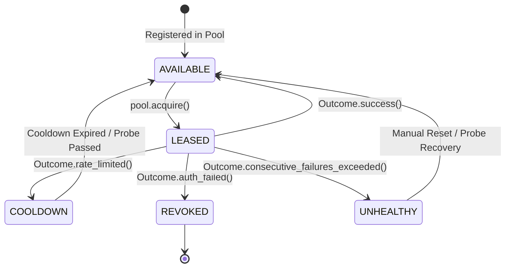

# 🧵 CredWeave

<div align="center">

**Provider-agnostic credential pooling, intelligent scheduling, rate-limit cooldown, and automatic failover for Python.**

[](https://pypi.org/project/credweave/)
[](https://www.python.org/downloads/)
[](https://opensource.org/licenses/MIT)
[](https://github.com/astral-sh/ruff)
[](https://mypy-lang.org/)
[](pyproject.toml)

[Key Features](#-key-features) •
[Why CredWeave?](#-why-credweave) •
[Design Philosophy](#-core-design-philosophy) •
[Quickstart](#-quickstart) •
[Architecture](#️-clean-architecture) •
[Security](#️-security--defense-in-depth-guarantees) •
[Roadmap](docs/ROADMAP.md) •
[Contributing](docs/CONTRIBUTING.md)

</div>

---

## 📌 Why CredWeave?

Production applications communicating with external services—such as LLM APIs, cloud providers, and third-party SaaS—often start with a single API key in an `.env` file. 

As workload scale increases, systems quickly outgrow single-credential architectures:

* 🏢 **Multiple Accounts & Tenants:** Distributing load across organization tiers, departments, or multiple provider accounts.
* ⏱️ **Rate-Limit Throttling:** Encountering `429 Too Many Requests` spikes requiring automated cooldown windows and upstream `Retry-After` adherence.
* 🔀 **Failover & High Availability:** Automatically routing around revoked tokens, depleted credit quotas, or regional outages without downtime.
* 🔄 **Dynamic Scheduling:** Balancing requests fairly using Round-Robin, Weighted distribution, or Least-Recently-Used heuristics.
* 🔒 **Security Risks:** Secret values accidentally leaking into APM traces, exception tracebacks, or console logs.

Most teams end up hand-crafting fragile, ad-hoc rotation loops tightly coupled to a specific HTTP client (`httpx`, `requests`) or provider SDK (`openai`, `anthropic`).

**CredWeave** solves this once and for all: a clean, reusable, protocol-agnostic credential lifecycle engine for Python with **zero external dependencies**.

---

## ✨ Key Features

| Feature | Description |
| :--- | :--- |
| 🛡️ **Secret-Safe by Design** | Secrets are automatically masked (`***`) in `repr()`, `str()`, and exception messages. Zero accidental leaks in logs. |
| 🔌 **Protocol & Client Agnostic** | Works seamlessly with **any** HTTP client, gRPC client, or provider SDK (`httpx`, `aiohttp`, `requests`, OpenAI, etc.). |
| ⏳ **Intelligent Cooldowns** | Automatically isolates rate-limited keys with fixed durations or exponential backoff, respecting upstream `retry_after`. |
| 🔀 **Resilient Failover** | Seamlessly pivots to secondary/backup credential tiers when primary quotas are exhausted or credentials fail. |
| 🔄 **Pluggable Scheduling** | Round-robin, weighted allocation, least-recently-used, and custom selection strategies. |
| 📊 **Outcome-Driven Lifecycle** | Simple lease model where clients report outcomes (`success`, `rate_limited`, `auth_failed`, `transient_error`). |
| 🪶 **Zero Dependencies** | Built strictly on the Python standard library. Hyper-lightweight and blisteringly fast. |
| 🏗️ **Clean Architecture** | Strict inward dependency rule: pure Domain models, well-defined Application ports, and pluggable Infrastructure. |

---

## 💡 Core Design Philosophy

> 🔑 **CredWeave manages credentials and their lifecycle. It does not perform network requests itself.**

```
┌─────────────────────────────────────────────────────────────────┐
│                      Your Application / Task                    │
│                                                                 │
│   1. Acquire Lease         2. Make Request     3. Report Result │
└───────────┬───────────────────────┬─────────────────────▲───────┘
            │                       │                     │
            ▼                       ▼                     │
   ┌─────────────────┐     ┌─────────────────┐            │
   │ 🧵 CredWeave    │     │ 🌐 Upstream API │            │
   │ Credential Pool │     │ (OpenAI, Cloud) │            │
   └─────────────────┘     └────────┬────────┘            │
                                    │                     │
                                    └─────────────────────┘
```

By decoupling credential management from networking, your codebase retains complete control over HTTP clients, connection pools, custom retry policies, and telemetry.

---

## 🚀 Quickstart

### 1. Installation

```bash
pip install credweave
```

*(Currently in active development: install from source or editable mode via `pip install -e .`)*

### 2. Basic Usage

Define credentials, initialize a pool, acquire a lease, and report the execution outcome:

```python
import asyncio
from credweave import Credential, CredentialPool, Outcome

# 1. Define credentials with secret material and arbitrary metadata
credentials = [
    Credential(
        id="openai-prod-team-a",
        secrets={"api_key": "sk-proj-live-mock-key-alpha"},
        metadata={"tier": "primary", "rate_limit_rpm": 5000},
    ),
    Credential(
        id="openai-prod-team-b",
        secrets={"api_key": "sk-proj-live-mock-key-beta"},
        metadata={"tier": "fallback", "rate_limit_rpm": 2000},
    ),
]

# 2. Instantiate a pool
pool = CredentialPool(credentials=credentials)


# 3. Acquire a lease, execute your request, and report the outcome
async def dispatch_request() -> None:
    # Acquire the optimal eligible credential:
    lease = await pool.acquire()

    try:
        # Retrieve secret for network execution
        api_key = lease.credential.get_secret("api_key")

        # >>> Execute with your preferred client (e.g. httpx, openai, etc.) <<<
        # response = await openai_client.chat.completions.create(...)

        # Report successful completion:
        await pool.report(lease, Outcome.success())

    except RateLimitException as exc:
        # Credential is automatically put in cooldown; upstream retry_after respected:
        await pool.report(
            lease,
            Outcome.rate_limited(retry_after=exc.retry_after, reason=str(exc)),
        )

    except AuthenticationException as exc:
        # Permanently isolate compromised or revoked credentials:
        await pool.report(
            lease,
            Outcome.auth_failed(reason="Invalid API Key or Revoked Token"),
        )
```

---

## 🔄 The Lease Lifecycle

CredWeave uses a formal **Lease** pattern to ensure atomic handling, state tracking, and concurrency safety:



1. **Acquire:** The pool evaluates eligible credentials using the configured `SelectionStrategy` and yields an active `Lease`.
2. **Execute:** The client performs the desired operation using the credential secrets.
3. **Report:** The client returns the `Lease` along with a standardized `Outcome` (`success`, `rate_limited`, `auth_failed`, `transient_error`).
4. **Transition:** The state store updates credential state, adjusts backoff timers, or escalates health flags.

### Concurrency caps and lease timeouts

```python
pool = CredentialPool(
    [
        Credential("primary", secrets={"api_key": "..."}, metadata={"max_concurrency": 2}),
        Credential("backup", secrets={"api_key": "..."}),
    ],
    max_concurrency_per_credential=5,  # default cap; None (the default) means unlimited
    lease_timeout=60.0,  # unreported leases are reclaimed after 60 s
)
```

A credential at its cap is skipped (its health is untouched) until a slot frees up, and the cap is enforced atomically in the state store, so it holds across threads, asyncio tasks and pools sharing one store. Leases that are never reported are reclaimed automatically on the next `acquire`/`report`, or on demand with `pool.reclaim_expired_leases()`; a late `report` of a reclaimed lease raises `LeaseExpiredError`.

---

## 🔌 Credential Sources

Besides in-memory credentials (`StaticSource`), a pool can load credentials from the environment or a JSON file and **pick up rotations while running**, with no pool recreation and no background thread. Sources are re-read on every acquire; state (usage, cooldowns, health) stays attached to the stable credential `id`. A secret that was rotated away from is never re-adopted: a pool still holding an older snapshot gets no leases from it, so it cannot undo a rotation or revive a revoked credential.

### `EnvSource`: credentials from environment variables

Configure **variable names**, never secret values:

```python
from credweave import CredentialPool, EnvCredential, EnvSource

source = EnvSource(
    [
        EnvCredential(
            id="openai-primary",
            secrets={"api_key": "OPENAI_API_KEY_PRIMARY"},  # secret field -> env var name
            optional_secrets={"org_id": "OPENAI_ORG_PRIMARY"},  # omitted when unset
            metadata={"tier": "primary", "max_concurrency": 4},
        ),
        EnvCredential(id="openai-backup", secrets={"api_key": "OPENAI_API_KEY_BACKUP"}),
    ]
)
pool = CredentialPool(source=source)
```

A required variable that is unset or empty raises `CredentialSourceError` (naming the variable, never a value). Pass `environ={...}` to read from an injected mapping instead of `os.environ`, e.g. in tests.

### `JsonSource`: credentials from a JSON file

```json
{
  "credentials": [
    {
      "id": "primary",
      "secrets": {"api_key": "<your-api-key>"},
      "metadata": {"tier": "primary", "max_concurrency": 2}
    },
    {"id": "backup", "secrets": {"api_key": "<your-backup-api-key>"}}
  ]
}
```

```python
from credweave import CredentialPool, JsonSource

source = JsonSource("credentials.json")  # raises CredentialSourceError if invalid
pool = CredentialPool(source=source)

lease = pool.acquire_sync()  # always sees the newest valid file contents
...
print(source.reload_status)  # generation, last_error, consecutive_failures
```

- **Strict schema:** top-level `credentials` list; each entry has a unique non-empty `id`, a non-empty `secrets` object of strings, and an optional `metadata` object. Unknown fields, duplicate keys, wrong types and `NaN` are rejected, with secret-safe messages that never echo file content.
- **Rotation:** replace the file (ideally atomically: write a temp file, then `os.replace`). A changed secret under the same `id` is used by future leases, while the credential's history and cooldown are preserved. Added credentials are eligible immediately; removed ones receive no new leases, and their active leases can still be reported.
- **Last known good:** if the file turns malformed, the previous credentials keep being served and `source.reload_status` / `source.refresh()` report the error. Only the initial load raises.
- **Cost:** one `stat` per read (tune with `JsonSource(path, min_check_interval=1.0)`). The async API runs file work off the event loop.

> `YamlSource` is not available yet: it needs a YAML parser, which the zero-dependency standard library does not provide.

---

## 🛡️ Security & Defense-in-Depth Guarantees

Handling API keys, bearer tokens, and secrets requires strict security invariants and defense-in-depth:

### 1. Automatic Secret Masking
Secret dictionary keys are visible for debugging, but secret values are masked as `'***'` in all representations (`__repr__`, `__str__`):

```python
from credweave import Credential

cred = Credential(id="ai-key", secrets={"api_key": "sk-secret-12345"})

print(cred)
# Output: Credential(id='ai-key', secrets={'api_key': '***'}, metadata={})

repr(cred)
# Output: "Credential(id='ai-key', secrets={'api_key': '***'}, metadata={})"
```

### 2. Safe Secret Access
Secret values are accessed explicitly via `cred.get_secret("key")`. Attempting to retrieve a missing key raises a clean `SecretAccessError` without exposing environment state.

### 3. Exception & Log Sanitization
Exception classes across CredWeave never format or interpolate raw secret values into error messages. Known secret values and identifiable token patterns are redacted from representations and diagnostics.

### 4. Deep Immutability
All credential dictionaries, views, and nested metadata structures are deeply frozen and immutable, preventing accidental runtime mutation or tampering.

---

## 🏗️ Clean Architecture

CredWeave is engineered strictly following Clean Architecture principles:

```
src/credweave/
├── domain/                  # Pure enterprise entities & domain rules
│   ├── models.py            # Credential, Lease (Immutable data structures)
│   ├── outcomes.py          # Outcome & OutcomeType
│   ├── enums.py             # CredentialState, OutcomeType
│   └── errors.py            # CredWeave domain exception hierarchy
├── application/             # Use cases & port protocols
│   ├── ports/               # Clock, CredentialSource, SelectionStrategy, StateStore
│   └── services/            # CredentialPool orchestration
├── infrastructure/          # Adapters implementing application ports
│   ├── clocks/              # SystemClock (real-time execution)
│   ├── sources/             # StaticSource, EnvSource, JsonSource, FileReloader
│   └── stores/              # MemoryStateStore
└── __init__.py              # Curated, strictly-typed public API exports
```

For complete architectural specifications, thread-safety invariants, and design trade-offs, explore our [Architecture Guide](docs/architecture/architecture.md).

---

## 🗺️ Roadmap

CredWeave is evolving through distinct, carefully planned phases—from the initial architectural foundation and secret-safe domain models to intelligent scheduling, distributed state stores, and cloud secret managers.

For a detailed breakdown of release phases and planned capabilities, see the full **[Roadmap](docs/ROADMAP.md)**.

---

## 🤝 Contributing

We welcome contributions from the community! Whether you are fixing a bug, adding new strategies, improving documentation, or proposing features, please check out our **[Contributing Guide](docs/CONTRIBUTING.md)** for development setup, testing workflows, and architectural guidelines.

---

## 📄 License

This project is licensed under the terms of the [MIT License](LICENSE).
