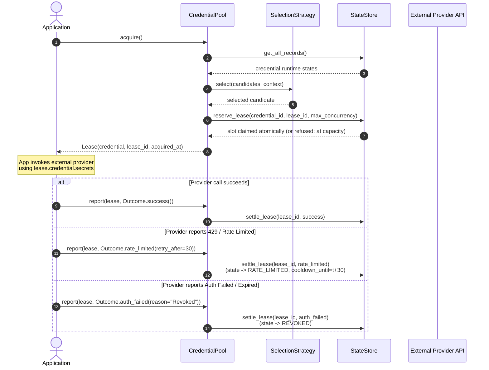
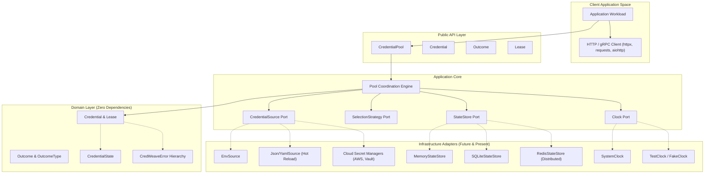

# CredWeave Architecture & Design Guide

## 1. System Boundary & Core Invariants

CredWeave is a provider-agnostic, protocol-independent credential lifecycle engine. Its responsibility is managing credential pools, scheduling, rotation, cooldowns, and health states.

### Architectural Invariants
1. **Lifecycle Decoupling:** CredWeave manages credentials and their state transitions. It never performs network calls or external provider requests itself.
2. **Protocol Agnosticism:** The core contains no HTTP, REST, gRPC, or provider-specific abstractions.
3. **Inward Dependency Direction:** Domain primitives have zero dependencies on infrastructure, frameworks, or storage backends.

---

## 2. Clean Architecture & Layering

CredWeave adheres to Clean Architecture adapted pragmatically for an idiomatic Python library. Dependencies strictly flow inward:

```text
       ┌────────────────────────────────────────────────────────┐
       │                       Public API                       │
       │                   (credweave package)                  │
       └───────────────────────────┬────────────────────────────┘
                                   │
                                   ▼
       ┌────────────────────────────────────────────────────────┐
       │                Infrastructure / Adapters               │
       │              (Clocks, Sources, Stores)                 │
       └───────────────────────────┬────────────────────────────┘
                                   │
                                   ▼
       ┌────────────────────────────────────────────────────────┐
       │                   Application Layer                    │
       │           (Services, Ports / Protocols)                │
       └───────────────────────────┬────────────────────────────┘
                                   │
                                   ▼
       ┌────────────────────────────────────────────────────────┐
       │                      Domain Layer                      │
       │               (Models, Outcomes, Errors)               │
       └────────────────────────────────────────────────────────┘
```

### The Inward Dependency Rule

1. **Domain (`credweave.domain`):**
   - Contains enterprise entities, value objects, domain enums, and domain errors.
   - Zero dependencies on any external framework, cloud SDK, database, or HTTP library.
   - Pure Python standard library only.
2. **Application (`credweave.application`):**
   - Coordinates use cases, lease lifecycle, and defines **Ports** (interfaces/protocols) for external dependencies:
     - `Clock` (timekeeping & delays)
     - `CredentialSource` (credential ingestion & hot reload)
     - `SelectionStrategy` (scheduling algorithms)
     - `StateStore` (persistence of state & cooldowns, plus the lease registry that backs concurrency caps and lease reclamation)
   - Contains orchestration services like `CredentialPool`.
3. **Infrastructure (`credweave.infrastructure`):**
   - Implements application ports with specific technologies (e.g. system clock, SQLite/Redis state stores, environment variable sources, cloud secret managers).
   - Pluggable and optional; can be swapped without altering domain logic.
4. **Public API (`credweave`):**
   - Re-exports clean, typed, stable public interfaces. Hides internal modules (`_internal`).

---

## 3. Core Architectural Decisions

### 3.1 Generic Structured Credentials vs. Provider-Specific Models

Rather than creating distinct classes for `OpenAIApiKey`, `AwsCredentials`, `SshKeyPair`, or `CookieAuth`, CredWeave models credentials generically via `Credential`:

```python
Credential(
    id="modal-team-primary",
    secrets={
        "token_id": "ak_live_xyz123",
        "token_secret": "sk_live_secret789",
    },
    metadata={
        "account": "analytics-team",
        "tier": "enterprise",
        "region": "us-east-1",
    },
)
```

**Why this decision?**
1. **Universal Applicability:** A credential is fundamentally a named identity possessing secret material required to authenticate, along with metadata describing its capabilities.
2. **Zero Upstream Coupling:** Adding a new cloud provider or AI platform requires zero changes or releases in CredWeave.
3. **Multi-token support:** Accommodates key-secret pairs, session cookies, OAuth refresh tokens, mTLS certificates, or bearer tokens identically.

### 3.2 Strict Separation of Secrets and Metadata

`Credential` separates its payload into two explicit domains:
- **`secrets`:** Sensitive data required by the target service.
  - Redacted from all string formatting (`repr`, `str`).
  - Wrapped in read-only mapping proxies to prevent mutation.
- **`metadata`:** Diagnostic, scheduling, and descriptive attributes (provider name, tenant, region, tier, concurrency limits).
  - Safe for diagnostic inspection, logging, and strategy filtering.

### 3.3 The Core Does Not Understand HTTP

CredWeave deliberately contains no HTTP parsing, socket handling, or networking code.

**Why?**
1. Credentials are used across diverse protocols: REST/HTTP, gRPC, WebSocket, database connections, message queues, and proprietary binary RPCs.
2. HTTP clients vary widely (`httpx`, `aiohttp`, `requests`, `urllib3`, `curl_cffi`). Hardcoding one would bloat dependencies and cause version conflicts.
3. The application executing the call understands the protocol and knows how to map its responses to domain outcomes.

### 3.4 Why `Outcome` Exists Instead of Raw Status Codes

Rather than accepting raw HTTP status codes (like `429` or `401`), callers report an `Outcome` value object:

```python
outcome = Outcome.rate_limited(
    retry_after=60.0,
    reason="Provider rate limit exceeded on endpoint /v1/chat/completions",
)
await pool.report(lease, outcome)
```

**Why?**
- **Protocol Independence:** Different services convey throttling differently (e.g. HTTP 429, gRPC `RESOURCE_EXHAUSTED`, database connection errors, or JSON response bodies like `{"error": "rate_limit"}`).
- **Granular Classification:** An HTTP 400 could mean client payload error (not credential-related), or it could mean an invalid project ID tied to that specific key. The calling application determines whether an error reflects on the credential's health.
- **Rich Context:** An `Outcome` can carry recommended `retry_after` durations, categorized root causes, and non-secret telemetry.

### 3.5 The Acquire / Report Lease Lifecycle

Credential scheduling follows an explicit **lease** pattern:



**Benefits of Leases:**
- Concurrency tracking: The state store tracks how many active leases exist for each credential and enforces optional per-credential caps (see 3.5.1).
- Leak prevention: With `lease_timeout`, expired or un-reported leases are reclaimed automatically and release their concurrency slot (see 3.5.2).
- Idempotent reporting: Each report is linked to a specific execution lease ID.

#### 3.5.1 Per-Credential Concurrency Caps

A cap limits how many leases of one credential may be in flight at once. `None` (the default) means unlimited.

- `CredentialPool(max_concurrency_per_credential=N)` sets the pool-wide default.
- A credential's non-secret `max_concurrency` metadata overrides it (an explicit `None` there means unlimited for that credential).
- Zero, negative, `bool`, string and other non-integer limits raise `ConfigurationError`. Limits on the initial credentials are validated at construction; limits on credentials supplied by a dynamic source are validated when they are first considered for a lease.

Enforcement is **atomic and lives in the `StateStore` port**, not in the pool: `reserve_lease()` checks the credential's in-flight count and claims the slot in a single step, so the cap holds across threads, asyncio tasks, mixed sync/async callers and any number of pools sharing one store. The pool never performs a read-check-write sequence.

- A credential at its cap is *temporarily ineligible*: it is simply not offered to the strategy. Its health state, failure counter and cooldown are untouched, so round-robin, failover and the other strategies naturally route around it and return to it as soon as a slot frees up.
- If a strategy picks a credential whose last slot is taken by a concurrent acquirer before the reservation lands, the pool refreshes its snapshot, excludes that credential for the rest of the call and selects again. If nothing is left it raises `NoCredentialsAvailableError`.

#### 3.5.2 Lease Timeouts and Automatic Reclamation

Every lease registered in the store carries its own deadline (`acquired_at + lease_timeout`, or none when no timeout is configured). A lease whose deadline has passed and which was never reported is *orphaned*; reclaiming it releases its concurrency slot.

- **Automatic:** every `acquire` and `report` (sync and async) first reclaims expired leases. No background thread or event-loop task is involved, so there is nothing to start, stop or leak.
- **Explicit:** `pool.reclaim_expired_leases()` / `await pool.reclaim_expired_leases_async()` do the same on demand and return the reclaimed `LeaseRecord`s, e.g. to free capacity eagerly or to log orphans.
- Reclamation applies **no** outcome (neither success nor failure) and leaves credential health exactly as it was; it only decrements in-flight accounting.
- It is exactly-once and idempotent: the lease is removed from the registry in the same atomic step that decrements the counter, so a lease can never be released twice and counters cannot go negative, whether the release came from a reclaim, a late report, or a race between the two.
- A reclaimed lease can no longer be reported: `report` raises `LeaseExpiredError` and applies nothing. (The store remembers a bounded number of recently reclaimed lease ids to distinguish those from never-issued ones, which raise `InvalidLeaseError`.)
- Because deadlines are stored with the leases and the registry is shared, a pool without `lease_timeout` still frees capacity held by expired leases of another pool on the same store.
- Reporting is retry-safe: `settle_lease()` computes the new state before it mutates anything, so if the store raises, the lease stays registered and can be reported again without leaking or double-releasing a slot.

### 3.6 Equality and Hashing Semantics

`Credential` equality and hashing are strictly based on the credential's `id`:
```python
def __eq__(self, other: object) -> bool:
    if not isinstance(other, Credential):
        return NotImplemented
    return self.id == other.id


def __hash__(self) -> int:
    return hash((Credential, self.id))
```
**Rationale:**
Within a managed pool, a credential is an entity whose identity is uniquely determined by its identifier (e.g. `"prod-primary-openai"`). Even if its secrets are rotated in place, it represents the exact same identity for tracking metrics, cooldowns, and leases.

### 3.7 Build Backend Decision: Hatchling

CredWeave uses **Hatchling** (`hatchling.build`) as its PEP 517/621 build backend:
- **Simplicity:** Pure declarative configuration inside `pyproject.toml` with zero extraneous setup files (`setup.py`, `setup.cfg`).
- **Standard `src/` layout support:** Hatchling auto-discovers packages under `src/` without fragile custom discovery flags.
- **Typing compliance:** Flawlessly bundles `py.typed` without legacy `MANIFEST.in` requirements.
- **Fast, modern, reproducible:** Avoids legacy setuptools build hooks and deprecation warnings.

### 3.8 Lifecycle Engine: Cooldown, Health & Backoff Rules

All credential-state business rules live in `LifecycleEngine` (`credweave.application.services.lifecycle`) and the pure `BackoffPolicy` value object (`credweave.domain.backoff`). The engine is a side-effect-free function from `(CredentialRecord, Outcome, now)` to a new `CredentialRecord`: no I/O, no locking, no clock reads, no networking. A `StateStore` only loads a record, calls the engine and persists the result atomically, so SQLite/Redis stores reuse the exact same rules as `MemoryStateStore`.

| Outcome | Result | Counts as health failure |
|---|---|---|
| `SUCCESS` | Resets failure progression; never overrides a stronger state set by another in-flight lease | no |
| `RATE_LIMITED` | `RATE_LIMITED` until `retry_after` (or the policy base delay if absent) | no |
| `QUOTA_EXHAUSTED` | `QUOTA_EXHAUSTED` until `retry_after`, indefinite if absent | no |
| `TRANSIENT_ERROR` | `COOLDOWN` for the backoff delay; `UNHEALTHY` once `max_consecutive_failures` is reached | yes |
| `PERMANENT_FAILURE` | `UNHEALTHY` | yes |
| `AUTH_FAILED` | `REVOKED` | yes |

**Backoff:** `delay(n) = min(max_delay, base_delay * multiplier ** (n - 1))` for the n-th consecutive failure (`multiplier=1` is a fixed cooldown). Optional proportional `jitter` in `[0, 1]` removes a random share of the capped delay, so `max_delay` stays a hard ceiling. Randomness is an injectable `RandomSource` (e.g. `random.Random(seed).random`) for deterministic tests.

**`retry_after`:** the upstream hint is never shortened or capped. With `RetryAfterMode.FLOOR` (default for explicit policies) a failure cools down for `max(policy_delay, retry_after)`; with `RetryAfterMode.OVERRIDE` the hint replaces the policy delay. Pools created without an explicit `backoff` use a fixed `default_cooldown` in `OVERRIDE` mode, which preserves the pre-engine behavior. Rate limits and quota exhaustion are throttling, not health signals, so for them the hint is exact and the failure progression is neither consulted nor advanced.

**Recovery and probes:** when a timed cooldown elapses the credential returns to `AVAILABLE` with its failure count intact. That window is the half-open "probe" state: the credential is merely eligible again, a further failure escalates the backoff, and a `SUCCESS` resets it. Whether and how to probe a provider stays entirely with the caller; CredWeave performs no network requests.

```python
pool = CredentialPool(
    credentials,
    backoff=BackoffPolicy.exponential(1.0, multiplier=2.0, max_delay=60.0, jitter=0.2),
    max_consecutive_failures=5,
    rng=random.Random(42).random,  # optional: deterministic jitter
)
```

---

## 4. Architecture Diagram



---

## 5. Security & Secret Redaction Guidelines

> [!CAUTION]
> **CRITICAL SECURITY REQUIREMENT FOR ALL CONTRIBUTORS:**
> CredWeave manages sensitive credentials. Under no circumstances should secret values ever be logged, included in exception messages, or exposed via string representation.

1. **`repr()` and `str()` masking:**
   `Credential.__repr__` and `Credential.__str__` must ALWAYS mask secret values:
   ```python
   # Output will be:
   # Credential(id='test', secrets={'api_key': '***'}, metadata={...})
   ```
2. **Exception messages:**
   Exceptions must never format dictionary values or raw secrets into error strings. They may reference parameter names, key names, or credential IDs.
3. **Environment and config isolation:**
   `.env` and other secret configuration files must never be committed to git. Example files (`.env.example`) must contain obvious mock placeholders.
4. **Log hygiene:**
   Never log `lease.credential.secrets`. Use `lease.credential.id` or `lease.credential.metadata` for telemetry and debugging.
